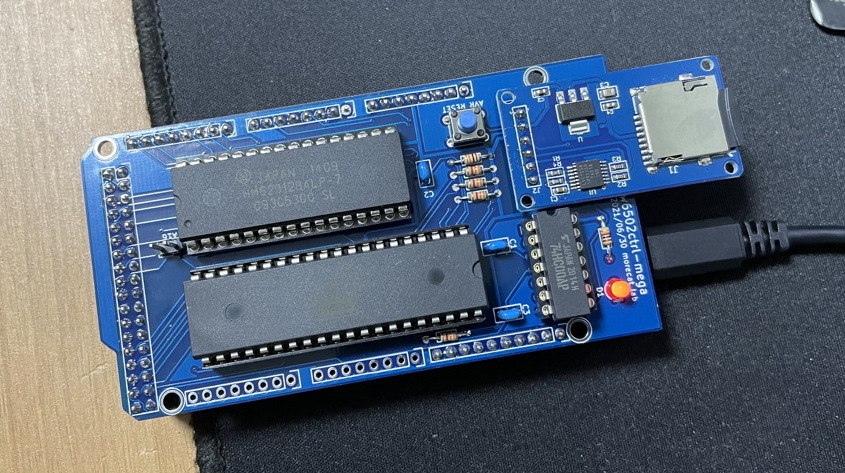

# 6502ctrl
AVR-based supervisor for a w65c02 microcomputer based on z80ctrl https://github.com/jblang/z80ctrl

6502ctrl has the following features:
* Support W65C02 and 64KB ram
* Console and other I/O are handled by DMA (ultra fast WAI instruction)
* Monitor with file management, memory inspector, and built-in 6502 disassembler
* Single-step debugging, breakpoints, and watchpoints to trace 6502 bus activity in real-time
* Flexible MIT-licensed firmware inhelited from z80ctrl
*

## Documentation

(under constructions)
